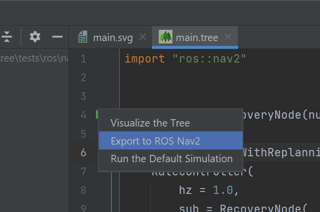
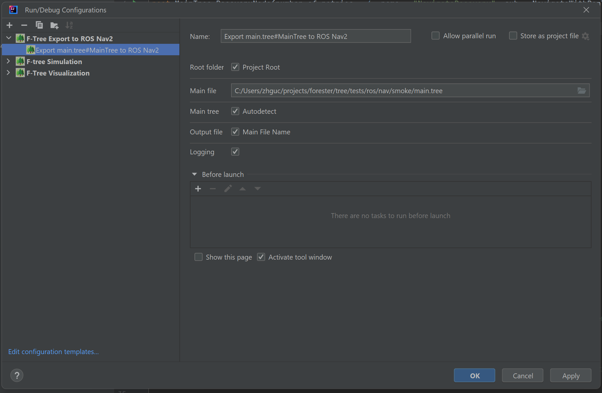
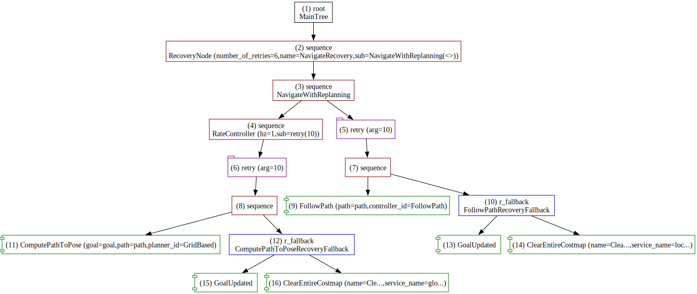

# Intro
Forester is an orchestration framework having the behavior trees as a core concept.
Above the trees, Forester provides a set of tools to make the behavior trees more flexible and powerful, 
including the higher order trees, the tree trimming, and the remote actions etc.
The behavior trees are a powerful tool providing the solid foundation to perform a wide range of tasks.
No surprise that the behavior trees are widely used in robotics. Or at least, they are starting to be used.
On the other hand, ROS is a de-facto standard in robotics and the module to navigation provides the behavior trees as well.

This article describes the process of exporting the behavior trees from Forester to ROS Nav2 BT format.
So, let's look in more detail at the behavior trees in ROS and Forester.

# Why?

The reasons are simple:
 - Forester can be more expressive in complex scenarios
 - Forester can provide extra advantages like the tree trimming and the remote actions in the future

Of course, for now the reasons are not so strong, but the Forester is a young project and it is growing fast.
But for now, the export is the simplest way to connect the scripts from one framework to another.

# How?

The process of exporting the behavior trees from Forester to ROS Nav2 BT format is quite simple.
Actually, there are three possible ways to do that.

## Using f-tree console utility

```shell
f-tree nav2 -h
```

which will show options
```shell
Options:
  -o, --output <OUTPUT>  a file for xml. If  no, the name from the main file will be taken.
  -r, --root <ROOT>      a path to a root folder. The <PWD> folder by default
  -m, --main <MAIN>      a path to a main file. The 'main.tree' by default
  -t, --tree <TREE>      a root in a main file. If there is only one root it takes by default
  -h, --help             Print help
```
All the options have the default values, so the simplest way to export the behavior trees is just
```shell
f-tree nav2
```

## Using the dedicated task in the IntelliJ plugin

Just click on the line root marker and pick the option to export to ROS Nav2
 
Or manually, create a task


## From rust code using Forester as dependency

```rust
#![allow(unused)]
fn main() {
    let mut root_path = test_folder("ros/nav/smoke");

    let project = Project::build("main.tree".to_string(), root_path.clone()).unwrap();
    let tree = RuntimeTree::build(project).unwrap().tree;
    fb.push("test.xml");

    tree.to_ros_nav(root_path.clone()).unwrap();

}
```

## Import
First of all, the definitions to export are restricted to the options that are presented on the ROS Nav2 side
The framework provides the specific list of actions from ros that can be imported
```shell
import "ros::nav2"
```
To see the content of the file
```shell
f-tree -d print-ros-nav2
```
Which spit out the following context (just example):
```ftree
    // Ros specific actions and decorators.
    // The actions are accessible using the import 'import "ros::nav2"'

    // --- Control nodes ---

    // PipelineSequence - Sequence of actions that are executed in a pipeline fashion.
    // In Forester, it is represented as a sequence

    // RoundRobin - Sequence of actions that are executed in a round robin fashion.
    // In Forester, it is represented as a fallback

    // RecoveryNode
    // The RecoveryNode is a control flow node with two children.
    // It returns SUCCESS if and only if the first child returns SUCCESS.
    // The second child will be executed only if the first child returns FAILURE.
    // If the second child SUCCEEDS, then the first child will be executed again.
    // The user can specify how many times the recovery actions should be taken before returning FAILURE.
    // In nav2, the RecoveryNode is included in Behavior Trees to implement recovery actions upon failures.
    // In Forester, it is represented as a decorator retry
    // Also there is a specific node RecoveryNode that is used in the nav2 Behavior Trees.

    // --- Actions ---

    // The RecoveryNode is a control flow node with two children.
    // It returns SUCCESS if and only if the first child returns SUCCESS.
    // The second child will be executed only if the first child returns FAILURE.
    // If the second child SUCCEEDS, then the first child will be executed again.
    // The user can specify how many times the recovery actions should be taken before returning FAILURE.
    // In nav2, the RecoveryNode is included in Behavior Trees to implement recovery actions upon failures.
    // <RecoveryNode number_of_retries="1">
    //     <!--Add tree components here--->
    // </RecoveryNode>
    // Parameters:
    // - input parameter: number_of_retries:num, default value: 1
    // - input parameter: sub:tree
    // - input parameter: name:string
    sequence RecoveryNode(number_of_retries:num, sub:tree, name:string) sub(..)

    // Checks if the global navigation goal has changed in the blackboard.
    // Returns failure if the goal is the same, if it changes, it returns success.
    //
    // This node differs from the GoalUpdated by retaining the state of the current goal/goals
    // throughout each tick of the BehaviorTree such that it will update on any "global" change to the goal.
    // <GlobalUpdatedGoal/>
    // Parameters:
    // - input parameter: name:string
    cond GloballyUpdatedGoal(name:string);

    // Invokes the Spin ROS 2 action server, which is implemented by the nav2_behaviors module. It performs an in-place rotation by a given angle.
    // This action is used in nav2 Behavior Trees as a recovery behavior.
    // <Spin spin_dist="1.57" server_name="spin" server_timeout="10" is_recovery="true" error_code_id="{spin_error_code}"/>
    // Parameters:
    // - input parameter: spin_dist:num, default value: 1.57
    // - input parameter: time_allowance:num, default value: 10
    // - input parameter: server_name:string
    // - input parameter: server_timeout:num, default value: 10
    // - input parameter: is_recovery:bool, default value: true
    // - output parameter: error_code_id:num
    // - input parameter: name:string
    impl Spin(spin_dist:num, time_allowance:num, server_name:string, server_timeout:num, is_recovery:bool, error_code_id:num, name:string);

..... 

    // A node that controls the tick rate for its child based on current robot speed.
    // The maximum and minimum replanning rates can be supplied to the node as parameters along with maximum and minimum speed.
    // The node returns RUNNING when it is not ticking its child.
    // Currently, in the navigation stack,
    // the SpeedController is used to adjust the rate at which the ComputePathToPose and GoalReached nodes are ticked.
    // <SpeedController min_rate="0.1" max_rate="1.0" min_speed="0.0" max_speed="0.5" filter_duration="0.3">
    //   <!--Add tree components here--->
    // </SpeedController>
    // Parameters:
    // - input parameter: min_rate:num, default value: 0.1
    // - input parameter: max_rate:num, default value: 1
    // - input parameter: min_speed:num, default value: 0
    // - input parameter: max_speed:num, default value: 0.5
    // - input parameter: filter_duration:num, default value: 0.3
    // - input parameter: sub:tree
    // - input parameter: name:string
    sequence SpeedController(min_rate:num, max_rate:num, min_speed:num, max_speed:num, filter_duration:num, sub:tree, name:string) sub(..)
```

## Notes
The control nodes are mapped to the nav2 control nodes directly:
 - PipelineSequence to sequence
 - RoundRobin to fallback
 - ReactiveFallback to r_fallback

If the control node has a name, it is used as the name of the control node in the nav2 tree.
```
sequence FollowPathWithFallback{
...
}
```
will become in ROS Nav2
```xml

<PipelineSequence name="FollowPathWithFallback">
...
</Pipe>
```

### Retry
The retry decorator is presented with 2 possible options
- retry(1)... which will be transformed directly
- RecoveryNode which has a name or the parameter that needs to be named

### Pointers
The pointers transform into "{pointer}" format.
For example, the following code
```ftree
ComputePathToPose(goal = goal,path = path,planner_id = "GridBased")
```
will become
```xml
<ComputePathToPose goal="{goal}" path="{path}" planner_id="GridBased"/>
```

## Example

```ftree
import "ros::nav2"

root MainTree
    RecoveryNode(
        number_of_retries = 6,
        name = "NavigateRecovery",
        sub = NavigateWithReplanning()
    )

sequence NavigateWithReplanning {
    RateController (
        hz = 1.0,
        sub = retry(10) sequence  {
            ComputePathToPose(goal = goal, path = path,planner_id = "GridB")
            ComputePathToPoseRecoveryFallback()
        }
    )
    retry(10) sequence  {
      FollowPath(path = path, controller_id = "FollowPath")
      FollowPathRecoveryFallback()
    }
}

r_fallback ComputePathToPoseRecoveryFallback {
    GoalUpdated()
    ClearEntireCostmap(
        name = "ClearGlobalCostmap-Context",
        service_name = "global_costmap/clear_entirely_global_costmap")
}

r_fallback FollowPathRecoveryFallback {
    GoalUpdated()
    ClearEntireCostmap(
        name = "ClearLocalCostmap-Context",
        service_name = "local_costmap/clear_entirely_local_costmap")
}
```

which transforms into
```xml
<root main_tree_to_execute="MainTree">
  <BehaviorTree ID="MainTree">
    <RecoveryNode number_of_retries="6" name="NavigateRecovery">
      <PipelineSequence name="NavigateWithReplanning">
        <RateController hz="1">
          <RecoveryNode number_of_retries="10">
            <PipelineSequence>
              <ComputePathToPose goal="{goal}" path="{path}" planner_id="GridBased"/>
              <ReactiveFallback name="ComputePathToPoseRecoveryFallback">
                <GoalUpdated/>
                <ClearEntireCostmap name="ClearGlobalCostmap-Context" service_name="global_costmap/clear_entirely_global_costmap"/>
              </ReactiveFallback>
            </PipelineSequence>
          </RecoveryNode>
        </RateController>
        <RecoveryNode number_of_retries="10">
          <PipelineSequence>
            <FollowPath path="{path}" controller_id="FollowPath"/>
            <ReactiveFallback name="FollowPathRecoveryFallback">
              <GoalUpdated/>
              <ClearEntireCostmap name="ClearLocalCostmap-Context" service_name="local_costmap/clear_entirely_local_costmap"/>
            </ReactiveFallback>
          </PipelineSequence>
        </RecoveryNode>
      </PipelineSequence>
    </RecoveryNode>
  </BehaviorTree>
</root>
```
and visualize (the long strings are omitted for better visibility)


# Conclusion
The article describes the process of exporting the behavior trees from Forester to ROS Nav2 BT format.
This the first approach to integrate the Forester with ROS Nav2. 
In the near future, the Forester will provide the remote actions to make the integration more flexible and powerful.
But for now, the next article will describe more complex examples of using the Forester with ROS Nav2.